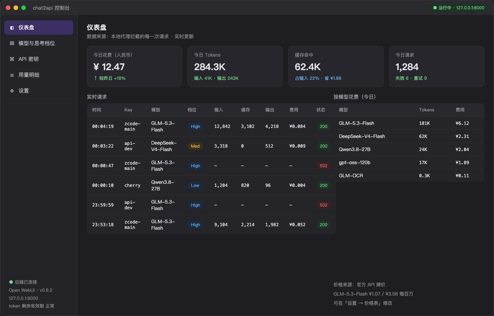
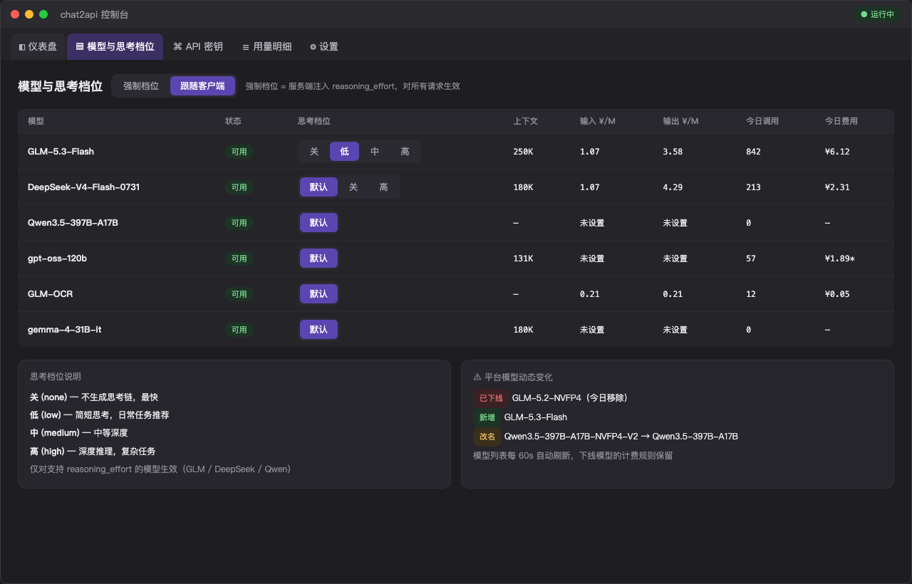
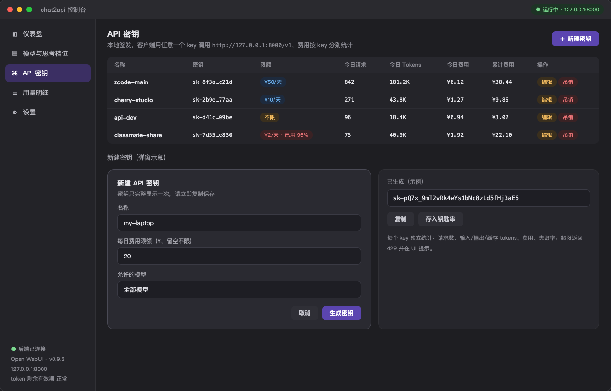
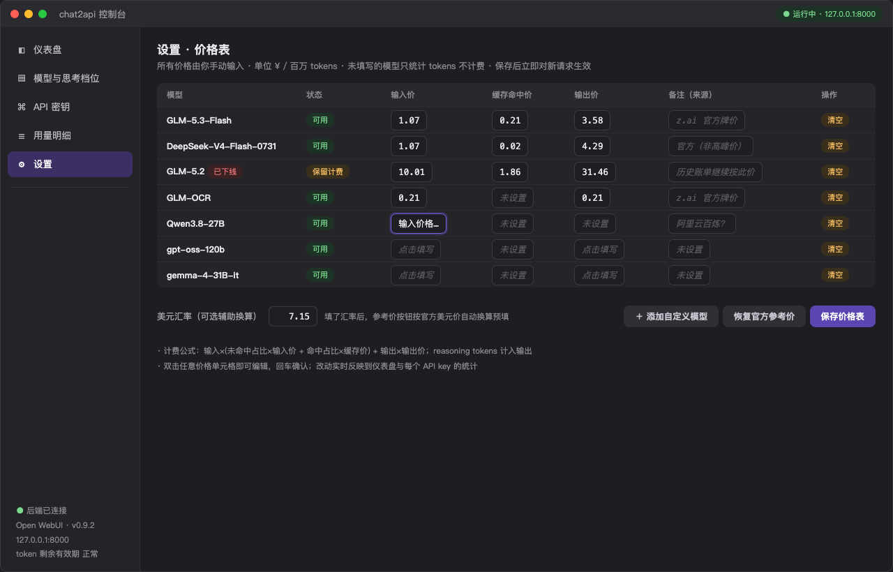

# chat2api 控制台 / Open WebUI Console

把任意 **Open WebUI** 实例包装成本地 **OpenAI 兼容 API**，并提供一个 macOS 原生风格的
**PySide6 控制台**：模型管理、思考档位、API 密钥分发、Token 用量与人民币成本统计，
全部可视化。

> Connect any Open WebUI instance as a local OpenAI-compatible API, with a macOS
> desktop console for models, thinking levels, API keys, and per-key cost tracking.

<p align="center">
  
</p>

## 功能特性

- 🔐 **浏览器会话登录**：Playwright 打开 Chrome 完成一次 SSO 登录，token 自动持久化、
  失效自动提示重登（带旧 token 校验，避免"假登录"循环）
- 📡 **OpenAI 兼容代理**：`/v1/models`、`/v1/chat/completions`，支持流式 SSE 透传
  （严格事件帧格式，兼容 eventsource-parser 类客户端）
- 🧠 **思考档位**：支持 `low / medium / high / xhigh / max` 五档；
  既可注册 `-Low/-High` 等虚拟模型由客户端选择，也可在界面里强制服务端注入
  `reasoning_effort`
- 🔑 **API 密钥分发**：本地签发 `sk-` 密钥给不同的人/客户端，按 key 分别统计
  用量与花费；可选「仅创建时复制一次」模式
- 💰 **成本核算**：价格表由用户手动输入（¥ / 百万 tokens），支持缓存命中独立计价、
  reasoning tokens 计入输出、未设价模型只统计不计费
- 📊 **用量明细**：按 API Key × 模型聚合，CSV 导出
- 🎨 **界面**：8 套配色主题、字体颜色、正统中文 / English 双语、自定义 JPEG 背景图
- 📋 **内置连接指南**：手把手教你在 ZCode / Cherry Studio 等 agent 里接入

## 界面预览

| 仪表盘 | 模型与思考档位 |
|---|---|
|  |  |

| API 密钥 | 价格表（手动输入） |
|---|---|
|  |  |

## 从源码运行

```bash
# Python 3.10+（开发机为 3.13）
pip install PySide6 requests playwright
python3 main.py --port 8000 --base-url https://your-openwebui.example.com
```

首次启动后在「设置」页点「重新登录」，在弹出的 Chrome 窗口里完成一次登录即可。

## 打包成独立 .app（macOS）

```bash
pip install pyinstaller
pyinstaller --windowed --name "chat2api" --icon app.icns --noconfirm \
  --hidden-import playwright.sync_api main.py
# 产物在 dist/chat2api.app
```

打包运行时数据（数据库 / token / 背景图）存放在
`~/Library/Application Support/chat2api-gui/`，与源码目录隔离。

## 连接 agent（ZCode / Cherry Studio 等）

| 参数 | 值 |
|---|---|
| Base URL | `http://127.0.0.1:8000/v1` |
| API 格式 | **OpenAI Chat Completions**（勿选 Responses） |
| API Key | 在「API 密钥」页签发，点击密钥即可复制 |
| 模型 | `GLM-5.3-Flash` 等平台模型，或带档位的 `GLM-5.3-Flash-High` |

App 内置「连接指南」页，含分步截图式说明与常见错误对照表
（401 / 502 / 501 / 连接被拒 → 原因与解法）。

## 给测试者的说明

- 本包为 **Apple Silicon（M 系列）** 构建，Intel Mac 需从源码运行
- 首次打开若被 Gatekeeper 拦截（"无法验证开发者"）：右键 App → 打开；
  或在终端执行 `xattr -cr /Applications/chat2api.app` 后再打开
- 你需要有一个可登录的 Open WebUI 站点账号；模型与算力来自该站点，
  请遵守所在机构的使用政策
- 测试产生的 key / 用量数据仅存于本机

## 免责声明

本项目仅供个人学习与内部测试使用，请遵守你所在机构/站点（Open WebUI 部署方）
的服务条款与用量政策。使用者需自行承担违规使用的后果。

## License

MIT
